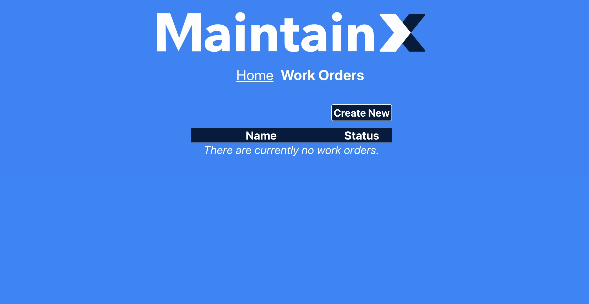

# MaintainX take-home project

## Tech & setup

When you setup this project (see "Get Started" in the next section), we provide you with some modules, tooling, data and an example by default.

### Modules

These are the most important modules that get installed by default:

- TypeScript (https://www.typescriptlang.org/docs/)
- React (https://react.dev/learn)
- React Router (https://reactrouter.com/en/main/start/tutorial)
- Express (https://expressjs.com/en/guide/routing.html)

### Tooling

The setup comes ready with all the tooling that bundles your assets in the frontend (through Vite) and compiles your code from TypeScript to JavaScript on the fly in the backend.

### Data structure & data provided

The setup comes with a SQL table structure in place, with the following tables (and some populated data):

- Table with work orders: id, name, status (OPEN, CLOSED)
- Table with users: id, name, email
- Table with work order assignees: id, work_order_id, user_id

The detailed structure (with column types and such) can be found in `db.ts`.

We use in-memory SQLite for the small scope of this project, but we do provide a data.sql if you want to import the same data in a local MySQL database. You would need to rewrite `db.ts` to connect to your local server. (You can install a third-party driver, such as https://github.com/mysqljs/mysql, for this)

There is only a small set of sample data provided, but when implementing your business logic, presume there could be millions of rows in each table of the database.

### Example

The setup comes with an home page with basic styling and an example frontend page using routing and making a fetch call to the backend.

## What we're asking

- There is a simple console output in the backend that outputs every HTTP request. It currently outputs the HTTP method, the path requested and the status code of the response.
  _Add the date & time of the request at the beginning of the log, the format is up to you, but it has to be all numerical. For example: `1970-12-25 - 12:34:56`._ ✅
- We provide a `/workorders` page where we list work orders. Work orders are currently listed in chronological order of creation.
  _Change this so that all OPEN work orders are shown first, but still in chronological order._ ✅
- We provide a `/workorders/:id` page with details of a given work order: its name, its status, a list of its assignees and a button showing its current status.
  - _Add a small tooltip (written in CSS) such that when hovering an assignee's name, the tooltip shows their email address._ ✅
  - _Modify the button so that clicking on it toggles the open/close status of that work order._ ✅
- We provide a `/workorders/create` page where it's possible to create new work orders. There is a form where you can enter a name and select some assignees for the work order you want to create.
  - _Ensure that Work Orders always have a name._ ✅
  - _Ensure that Work Orders can have 0 or more assignees._ ✅
  - _This endpoint is known to be unstable and slow, ensure the user has relevant feedback in both circumstances._ ✅
  - _Make it more obvious when the submit button is disabled, using CSS._ ✅
- *Implement a new page /productivity that lists users that aren't assigned to an OPEN work order.*✅
- Implement at least one of the following features:
  - *The ability to search the work order list.*✅
  - *The ability to autocomplete assignee names when adding assignees to a work order.*✅
  - *The ability to delete a Work Order from the details page.*✅

## Guidelines

- We will only review what you submit on the `master` branch. Feel free to use branches or pull requests for your own workflow, but make sure to merge your changes into `master` before submitting.
- Don't hesitate to refactor/split in files, utilities, etc. In fact, we encourage it.
- Do not install any additional third-party module/package.
- Meaningful comments _in the code_ are encouraged to explain concerns/decisions/etc. Pull request comments will not be seen by reviewers.
- The CSS/stylings provided are only a base. Feel free to add, remove, re-style anything you want in order to improve the user interface (UI) or the user experience (UX).
- We will use the code submitted to evaluate your technical knowledge. Use this take-home as an opportunity to showcase your skills.
- You can use coding assistants or generative AI tools to help with this project. If you do, please commit your prompts and, if possible, give us a sense of your workflow. We'd love to understand how those tools fit into your process.

## Original Look

*The original application interface before implementing the requested features.*
